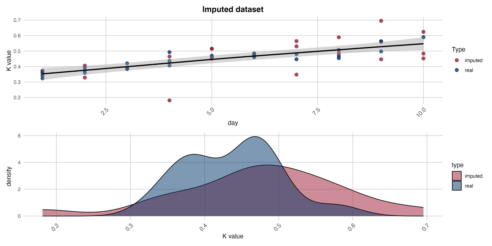

# **Introduction**

Researchers from the Faculty of Veterinary Medicine at the University of Milan conducted a
preliminary study aimed at evaluating the applicability of NIR (Near Infrared Reflectance)
spectroscopy for the identification and classification of perishable fresh meats. This analysis
aimes to verify if Nir is a valid instrument to classify fresh meats correctly.

## Plots

