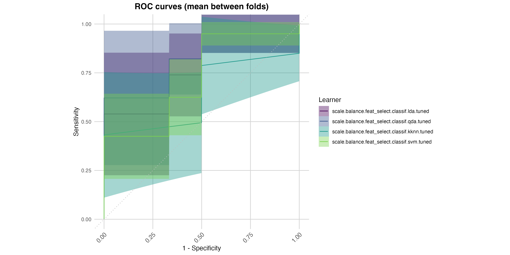
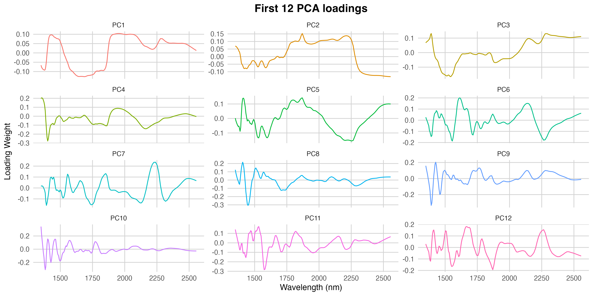

# Fish Freshness Classification via NIR Spectroscopy

## **Project Overview**

This repository contains the analytical pipeline for a study on fish freshness classification. The project moves
beyond simple spoilage detection to develop a high-resolution grading system capable of distinguishing between
"Standard Commercial" and "Premium" quality levels.

### The Problem

The K-value (a ratio of nucleotide degradation) is the gold standard for freshness but requires destructive,
time-consuming chemical analysis. This project uses Near-Infrared (NIR) Spectroscopy to predict K-value
categories non-destructively.

### The Two-Tier Objective

1. Safety Threshold (K=0.5): Separating good quality marketable fish from those beginning to deteriorate.

2. Premium Threshold (K=0.4): Isolating peak-quality fillets for high-end markets.

### **Data Engineering & Pre-processing**

1. Robust Aggregation and Imputation:

- Median Aggregation: Measurements were taken at five points per fillet. We used the median rather than the
mean to ensure the spectral signature was robust against local surface anomalies (e.g., scales or localized
dehydration).

- Predictive Mean Matching (PMM): To handle missing chemical values, we utilized PMM. This non-parametric
approach preserves the original distribution of the data better than simple mean imputation, ensuring realistic
approximations for the K-value components.

2. Spectral Pre-processing (Smoothing & SNV)

- Savitzky-Golay Smoothing: We applied a moving polynomial filter to reduce high-frequency instrumental noise
without attenuating the underlying chemical peaks. This step is vital for ensuring that feature selection
(like V1459) is based on real trends rather than random noise.

- Standard Normal Variate (SNV) Transformation: This normalization technique was used to correct for light
scattering effects caused by the physical texture of the fish muscle. SNV centers each spectrum and scales
it by its standard deviation, ensuring that the differences detected by the QDA model are due to chemical
concentration (K-value) rather than the distance between the sensor and the fillet or the thickness of the
sample.

3. Feature Selection Logic

- Standard Quality (0.5): Identified a "Gold Standard" marker at 1459 nm (O-H and N-H bonds).

- Premium Quality (0.4): Demonstrated that single-wavelength models collapse at this threshold, requiring a
Multivariate PCA approach to capture subtle biochemical shifts.

### **Model Performance & Results**

Threshold 0.5: Commercial Safety

- Best Model: Quadratic Discriminant Analysis (QDA).

- Performance: 81.9% Accuracy | 93.3% Specificity.

- Key Insight: The high specificity ensures a "Safe-to-Market" guarantee. The model is driven by the state of
water and protein hydration in the tissue.

Threshold 0.4: Premium Quality (Optimized PCA):

- The Breakthrough: Using a single variable, accuracy was <65%. By optimizing the Principal Component selection
(PC1, 2, 3, 4, 6, 7), accuracy was recovered to 75.7%.

- The Role of PC7: While early PCs capture 84% of the variance (physical light scattering), PC7 targets the
2250–2300 nm region. This region is critical for detecting changes in protein conformation and nitrogenous
metabolites—the true markers of "Premium" vs. "Acceptable" fish.

The table below summarizes the classification success for both investigated thresholds using the optimized
Quadratic Discriminant Analysis (QDA) model.

| Metric | Commercial Safety (0.5) | Premium Quality (0.4) |
| :--- | :---: | :---: |
| **Input Strategy** | Univariate (**V1459**) | Multivariate (**PCs 1,2,3,4,6,7**) |
| **Accuracy** | **81.9%** | **75.7%** |
| **Specificity** | **93.3%** | **81.9%** |
| **Sensitivity** | 63.9% | 61.7% |
| **AUC** | 0.801 | **0.748** |
| **Dominant Marker** | Water/Protein hydration (1459nm) | Protein/Ammino acid bonds (2250nm) |

### **Residual analysis: understanding the errors**

The models were built with a conservative bias, prioritizing the removal of sub-par fish over the risk
of false "Premium" labels.

- The Transition Zone: Most misclassifications occur in the K-value range of 0.40 to 0.56. In this "limbo"
phase, the fish is chemically no longer premium, but its physical structure (which the NIR detects) hasn't yet
fully collapsed.

All analyses were conducted with careful attention to avoiding bias and data leakage. Data preprocessing
and feature selection were fully embedded within the training pipeline using nested cross-validation.

author: "Luca Bernardi"
date: "2026-01-10"
