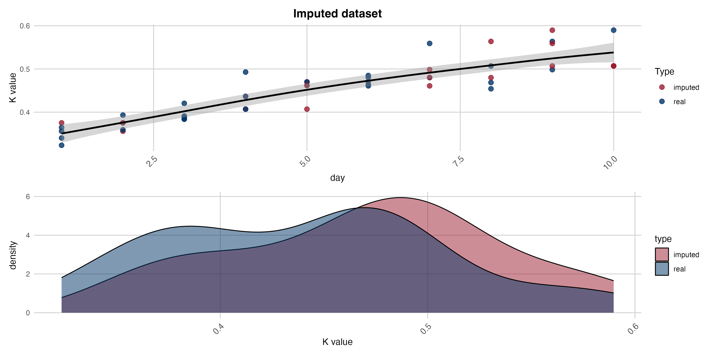
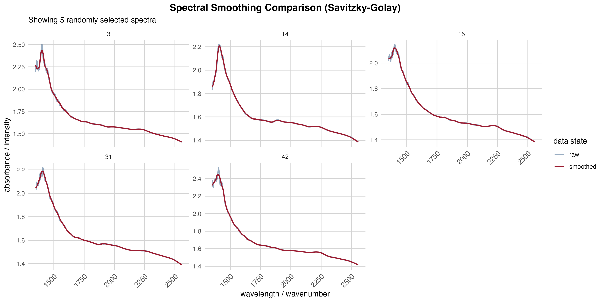

# **Introduction**

### *Introduction and study objectives*

### *Main objectives*

# **Data analysis**

### *Data preparation and pre-processing*

```{r exploration, echo = FALSE, message = FALSE, warning = FALSE, fig.width = 12}
source("settings.R")
source("source_all.R")

if (!file.exists("data/intermediate/data analysis.rds")) {
  build_data_main()
}

data.analysis <- readRDS("data/intermediate/data analysis.rds")

knitr::include_graphics("plot/densities1.png")
knitr::include_graphics("plot/densities2.png")

data.imputed <- readRDS("data/intermediate/data imputated.rds")



data.cluster <- data.analysis |> dplyr::select(grep("^[[:digit:]]*$", colnames(data.analysis), value = TRUE))
colnames(data.cluster) <- paste0("V", colnames(data.cluster))

data.cluster.smooth <- smoothing(data.cluster)
data.cluster.snv <- as_tibble(t(apply(data.cluster.smooth, MARGIN = 1, FUN = normalization)))

plot_spectral_comparison(data.cluster, data.cluster.snv, n_samples = 6)


data.cluster.final <- bind_cols(data.cluster.snv, class = data.analysis$class)
```

- large dataset, 5 measure position equivalent to each other (as seen in the hraphic, densities have are not symmetric), aggregation through median sample value. 
- variables used for imputation not normal (kolmogorov-smirnov test), so pmm best imputation method
- missing values (MAR) - imputation of missing trhough predictive mean matching (10 dataset imputaed, best dataset choosen - see graphic, imputed values for k-value overlapping the best)
- spectral measures aggregated through median, smoothed by taking 
- classification of samples thanks to kvalue - very fresh, fresh, deteriorated, very deteriorated


### *Correlation vs. feature selection*

-discussion about why feature seleciton is better than correlation

```{r features, echo = FALSE, message = FALSE, warning = FALSE, fig.width = 12}
cor.data <- data.analysis |> dplyr::select(!c(sample, class))
corr_Kvalue <- cor(cor.data)["K value",]

head(sort(abs(corr_Kvalue), decreasing = TRUE), 10)

task <- TaskClassif$new(
  id = "Classification original data",
  backend = data.cluster.final,
  target = "class",
  positive = "fresh"
)

task$col_roles$stratum <- "class"

methods <- c("anova", "auc", "mrmr")
tab <- as.data.frame(lapply(methods, function(i) feature_selection(task, i)))
colnames(tab) <- methods
head(tab, 10)
```

-auc and anova confirms some interesting features, we expect algorithm to choose similar features

### *QDA, LDA, k-NN and SVM on raw data (scaled and balanced) components*

```{r analysis.1, echo = FALSE, message = FALSE, warning = FALSE, fig.width = 12}
set.seed(123)
resampling.outer <- rsmp("cv", folds = 5)
resampling.instance <- resampling.outer$instantiate(task)

if (!file.exists("data/results/results1.rds")) {
  feature_analysis(task, resampling_instance = resampling.instance, filter_type = "mrmr")
}

results1 <- readRDS("data/results/results1.rds")
results1$performance

autoplot(results1$benchmark_obj, measure = msr("classif.auc")) + 
  labs(title = "Stabilità dell'AUC tra i 5 Fold") +
  theme_minimal() +
  theme(
    axis.text.x = element_text(size = 10, angle = 45, hjust = 1),
    plot.title = element_text(hjust = 0.5, size = 14, face = "bold"),
    panel.grid.major = element_line(color = "lightgray", linewidth = 0.5),
    panel.grid.minor = element_blank())

autoplot(results1$benchmark_obj, measure = msr("classif.acc")) + 
  labs(title = "Stabilità dell'Accuracy tra i 5 Fold") +
  theme_minimal() +
  theme(
    axis.text.x = element_text(size = 10, angle = 45, hjust = 1),
    plot.title = element_text(hjust = 0.5, size = 14, face = "bold"),
    panel.grid.major = element_line(color = "lightgray", linewidth = 0.5),
    panel.grid.minor = element_blank())

autoplot(results1$benchmark_obj, type = "roc") + 
  labs(title = "Confronto Curve ROC (Media dei Fold)") +
  theme_minimal() +
  theme(
    axis.text.x = element_text(size = 10, angle = 45, hjust = 1),
    plot.title = element_text(hjust = 0.5, size = 14, face = "bold"),
    panel.grid.major = element_line(color = "lightgray", linewidth = 0.5),
    panel.grid.minor = element_blank())

results1$learners$LDA$learner$graph_model$pipeops$feat_select$state$outtasklayout
results1$learners$QDA$learner$graph_model$pipeops$feat_select$state$outtasklayout
results1$learners$kNN$learner$graph_model$pipeops$feat_select$state$outtasklayout
results1$learners$SVM$learner$graph_model$pipeops$feat_select$state$outtasklayout
```

### *QDA, LDA, k-NN and SVM on PCA components*

```{r analysis.2, echo = FALSE, message = FALSE, warning = FALSE, fig.width = 12}

pca.res <- prcomp(data.cluster.final[, -141], center = TRUE, scale. = TRUE)
head(summary(pca.res)$importance[3, ], n = 12)

pca_representation_facet(pca.res, data.analysis$class, 6)

if (!file.exists("data/results/results2.rds")) {
  feature_analysis(task, resampling_instance = resampling.instance, filter = FALSE, pca = TRUE)
}

results2 <- readRDS("data/results/results2.rds")
results2$performance

autoplot(results2$benchmark_obj, measure = msr("classif.auc")) + 
  labs(title = "Stabilità dell'AUC tra i 5 Fold") +
  theme_minimal() +
  theme(
    axis.text.x = element_text(size = 10, angle = 45, hjust = 1),
    plot.title = element_text(hjust = 0.5, size = 14, face = "bold"),
    panel.grid.major = element_line(color = "lightgray", linewidth = 0.5),
    panel.grid.minor = element_blank())

autoplot(results2$benchmark_obj, measure = msr("classif.acc")) + 
  labs(title = "Stabilità dell'Accuracy tra i 5 Fold") +
  theme_minimal() +
  theme(
    axis.text.x = element_text(size = 10, angle = 45, hjust = 1),
    plot.title = element_text(hjust = 0.5, size = 14, face = "bold"),
    panel.grid.major = element_line(color = "lightgray", linewidth = 0.5),
    panel.grid.minor = element_blank())

autoplot(results2$benchmark_obj, type = "roc") + 
  labs(title = "Confronto Curve ROC (Media dei Fold)") +
  theme_minimal() +
  theme(
    axis.text.x = element_text(size = 10, angle = 45, hjust = 1),
    plot.title = element_text(hjust = 0.5, size = 14, face = "bold"),
    panel.grid.major = element_line(color = "lightgray", linewidth = 0.5),
    panel.grid.minor = element_blank())

results2$learners$LDA$learner$graph_model$pipeops$rank_select$state$outtasklayout
results2$learners$QDA$learner$graph_model$pipeops$rank_select$state$outtasklayout
results2$learners$kNN$learner$graph_model$pipeops$rank_select$state$outtasklayout
results2$learners$SVM$learner$graph_model$pipeops$rank_select$state$outtasklayout
```

### *Expert knowledge selection for pca components in qda model*

```{r analysis.4, echo = FALSE, message = FALSE, warning = FALSE, fig.width = 12}

# Definiamo il pool di componenti basandoci sull'evidenza dei tuoi modelli precendenti
pc_pool <- paste0("PC", 1:8)

# Generiamo tutte le combinazioni da 2 a 6 elementi. Questo produrrà esattamente 238 combinazioni
min_pc <- 2
max_pc <- 6

combinations_list <- map(min_pc:max_pc, function(k) {
  combs <- combn(pc_pool, k, simplify = FALSE)
  combs
}) |> flatten()

print(paste("Totale combinazioni da testare:", length(combinations_list)))

results_list <- lapply(combinations_list, function(x) {
  model_qda_deep_dive(task, resampling_instance =  resampling.instance, pca_fix = TRUE, pca_selected = x)
})

# Funzione per estrarre i dati da ogni elemento della lista prodotta da lapply
extract_metrics <- function(res_item, index) {
  if (is.null(res_item)) return(NULL)

  current_pcs <- paste(combinations_list[[index]], collapse = ", ")

  df <- data.frame(
    rank = index,
    pcs = current_pcs,
    acc = res_item$performance["classif.acc"],
    auc = res_item$performance["classif.auc"],
    sens = res_item$performance["classif.sensitivity"],
    spec = res_item$performance["classif.specificity"],
    stringsAsFactors = FALSE
    )
}

# Applichiamo la funzione a tutta la lista dei risultati
summary_df <- imap_dfr(results_list, extract_metrics)

top_10_results <- summary_df |> arrange(desc(auc), desc(spec)) |> head(10)
rownames(top_10_results) <- top_10_results$rank
top_10_results |> dplyr::select(!rank)
print(top_10_results)

result_final<- model_qda_deep_dive(task, resampling_instance = resampling.instance, pca_rank = 12, pca_fix = TRUE, pca_selected = c("PC1","PC2", "PC3", "PC5"))
```

## **Results**

```{r results, echo = FALSE, message = FALSE, warning = FALSE, fig.width = 12}
# Estraiamo le predizioni
preds <- as.data.table(result_final$resampling_results$prediction())

# Identifichiamo i Falsi Positivi (Verità = deteriorated, Risposta = fresh)
falsi_positivi_ids <- preds[truth == "deteriorated" & response == "fresh", row_ids]

# Estraiamo i dati dal dataset originale
colpevoli_data <- data.cluster.compare[falsi_positivi_ids, ]

# Creiamo il riepilogo (usa i nomi esatti delle tue colonne)
riepilogo_errori <- data.frame(
  Row_ID = falsi_positivi_ids,
  Giorno = colpevoli_data$day
  )

print("--- Campioni Deteriorati classificati come Fresh (Falsi Positivi) ---")
print(riepilogo_errori)
```
