## **Introduction**

### Introduction and study objectives

Researchers from the Faculty of Veterinary Medicine at the University of Milan conducted a preliminary study to evaluate the applicability of Near-Infrared Reflectance (NIR) spectroscopy for the identification and classification of perishable fresh fish products. NIR spectroscopy is a rapid, non-destructive analytical technique that is harmless to the sample and therefore well suited for routine quality control. The method relies on the interaction between near-infrared radiation and molecular bonds within the sample: the absorbed energy excites characteristic vibrational modes of chemical bonds, producing a spectrum that reflects the chemical and physical composition of the material and can be interpreted as a spectral “fingerprint.”

### Main objectives

Building on previous exploratory investigations, the objectives of this study were twofold:

1. To investigate the relationship between NIR spectral information and the K-value, a widely used freshness index defined as the ratio between inosine monophosphate (IMP) and its degradation products (inosine and hypoxanthine), which reflects post-mortem biochemical changes in fish muscle.

$$
K(\%) = \frac{[Inosine] + [Hypoxanthine]}{[ATP] + [ADP] + [AMP] + [IMP] + [Inosine] + [Hypoxanthine]} \times 100
$$
where:

- $ATP$ = adenosine triphosphate
- $ADP$ = adenosine diphosphate
- $AMP$ = adenosine monophosphate
- $IMP$ = inosine monophosphate
- $Inosine$ = nucleoside derived from IMP hydrolysis
- $Hypoxanthine$ = final product of inosine degradation

2. To assess the ability of NIR spectroscopy to discriminate between marketable and non-marketable filets, with particular attention to the robustness and stability of classification models under different freshness thresholds.

Data were collected between May and June 2025 on a total of 49 gilthead seabream (Sparus aurata) filets. For each filet, NIR spectra were acquired at five distinct positions to account for spatial variability. The resulting dataset includes the following variables:

- Sample (filet ID)

- L* (lightness)

- a* (redness index)

- b* (yellowness index)

- C* (Chroma, derived from L*, a*, and b*)

- h (Hue angle / tone)

- Day (day the measurement was taken)

- mg N/100g (volatile basic nitrogen concentration)

- K-value (ratio of inosine monophosphate to inosine + hypoxanthine)

- NIR wavelengths (spectral intensity measured at different wavelengths)

## **Data analysis**

### Data preparation and pre-processing
The experimental data were organized into two distinct datasets: the first containing fillet lightness measurements and NIR spectra, and the second comprising the chemical components required to calculate the K-value, the reference index for freshness classification. Measurements were acquired at five different positions on each fillet. Due to the skewed nature of the resulting distributions, data were aggregated using the median for each sample. This choice ensured robustness against outliers and asymmetric distributions, effectively removing intra-sample dependencies and minimizing collinearity to improve the reliability of subsequent model training.

```{r exploration.1, echo = FALSE, message = FALSE, warning = FALSE, fig.width = 12}
source("settings.R")
source("source_all.R")

if (!file.exists("data/intermediate/data analysis.rds")) {
  build_data_main()
}

data_analysis <- readRDS("data/intermediate/data analysis.rds")

kableExtra::kable(data_analysis[,1:20], "html", caption = "Table 1: Original dataset") |>
  kableExtra::kable_styling(full_width = FALSE, font_size = 10) |>
  kableExtra::scroll_box(width = "100%", height = "400px")

knitr::include_graphics("plot/densities1.png")
knitr::include_graphics("plot/densities2.png")
```

The K-value index exhibited a substantial number of missing values due to the absence of some of the variables required for its calculation. The missingness pattern was identified as Missing at Random (MAR), allowing the application of imputation methods. Given the non-normal distribution of both the K-value and its components, Predictive Mean Matching (PMM) was employed. PMM is a non-parametric approach that imputes missing values by drawing from observed values with similar predicted means, ensuring that imputed values remain within the empirical range while preserving the original distribution through an explicit random component.

```{r exploration.2, echo = FALSE, message = FALSE, warning = FALSE, fig.width = 12}
pattern <- "^[[:digit:]]*$"
data_for_imputation <- data_analysis |> dplyr::select(!c(grep(pattern, colnames(data_analysis)), sample))

dt <- as.data.frame(cor(data_for_imputation, use = "complete.obs"))
kableExtra::kable(dt, "html", caption = "Table 2: Correlation matrix (only complete cases)") |>
  kableExtra::kable_styling(full_width = FALSE, font_size = 10) |>
  kableExtra::scroll_box(width = "100%", height = "400px")

m <- 10
imp <- mice(data_for_imputation[, -7], m = m, maxit = 50, seed = 123, method = "pmm", printFlag = FALSE)

imputed_Kvalues <- lapply(seq_len(m), function(i) {
  df <- complete(imp, i)
  df$`K value` <- calculate_kvalue(df)
})

imputed_pos <- which(is.na(data_for_imputation$`K value`))
real_vals <- data_for_imputation$`K value`[-imputed_pos]

ks_distances <- vapply(imputed_Kvalues, function(x) {
  imputed_vals <- x[imputed_pos]
  
  ks.test(real_vals, imputed_vals)$statistic
}, numeric(1))

best_idx <- which.min(unname(ks_distances))

trend_errors <- vapply(imputed_Kvalues, function(x) {
  df_temp <- data.frame(k = x, day = data_for_imputation$day)
  mod <- lm(k ~ day, data = df_temp[-imputed_pos, ])

  preds <- predict(mod, newdata = df_temp[imputed_pos, ])
  mean((x[imputed_pos] - preds)^2)
}, numeric(1))

best_idx <- which.min(trend_errors)

complete_data <- complete(imp, "long")

dt <- as.data.frame(cor(complete_data[, -c(14, 15)], use = "complete.obs"))
kableExtra::kable(dt, "html", caption = "Table 3: Correlation matrix (imputed data)") |>
  kableExtra::kable_styling(full_width = FALSE, font_size = 10) |>
  kableExtra::scroll_box(width = "100%", height = "400px")
```

To select the imputed dataset most consistent with the original data, several criteria were applied. Distributional similarity was assessed using the Kolmogorov–Smirnov test, while linear regression models were fitted to exploit the known linear relationship between storage days and K-value; the mean squared error (MSE) of the imputed observations was then computed. In addition, correlation matrices derived from the original dataset (Table 2) and from the imputed datasets (Table 3) were compared, showing that the overall correlation structure remained largely unchanged. This indicates that the imputation procedure did not introduce distortions that could compromise downstream analyses.

```{r exploration.3, echo = FALSE, message = FALSE, warning = FALSE, fig.width = 12}
imputed_df <- lapply(seq_len(m), function(i) {
  df <- complete(imp, i)
  df$`K value` <- calculate_kvalue(df)
  df
})

if (!file.exists("plot/imputation_1_Kvalue.png")) {
  graphics <- lapply(seq_along(imputed_df), function(i) {
  graphical_comparation(imputed_df[[i]], imputed_pos = imputed_pos, x = "day", y = "K value", x_ignore = TRUE, dataset_id = i)
  })
}

knitr::include_graphics("plot/imputation_2_Kvalue.png")
knitr::include_graphics("plot/imputation_5_Kvalue.png")

data_imputated <- imputed_df[[5]]
dt <- as.data.frame(data_imputated)
kableExtra::kable(dt, "html", caption = "Table 4: Imputed dataset") |>
  kableExtra::kable_styling(full_width = FALSE, font_size = 10) |>
  kableExtra::scroll_box(width = "100%", height = "400px") |>
  kableExtra::row_spec(imputed_pos, background = "#9B1B30", color = "white")
```

A final graphical comparison of the two most promising imputed datasets (datasets 2 and 5) was performed to evaluate the overlap between original and imputed distributions. Based on this assessment, dataset 5 was selected. The K-value was then computed on the complete dataset and used as the reference threshold for sample classification.

Classification thresholds were initially defined according to values reported in the literature:

- K ≤ 0.2: high-quality fish suitable for raw consumption

- 0.2 < K ≤ 0.5: good or acceptable quality

- 0.5 < K ≤ 0.7: incipient deterioration

- K > 0.7: spoiled fish

Given the limited sample size, these categories were further simplified using a conservative approach: all samples with K > 0.5 were classified as non-marketable.

```{r exploration.4, echo = FALSE, message = FALSE, warning = FALSE, fig.width = 12}
data_imputated$class <- ifelse(data_imputated$`K value` < 0.2, "very fresh",
  ifelse(data_imputated$`K value` <= 0.5, "good/acceptable", "impending spoilage/spoiled"))

data_imputated$class <- as.factor(data_imputated$class)

ggplot(data_imputated, aes(x = `K value`, fill = class)) +
  geom_histogram(position = "identity", alpha = 0.8, bins = 30, color = "white") +
  scale_fill_manual(values = c("good/acceptable" = "#003366", "impending spoilage/spoiled" = "#9B1B30"), name = "Class") +
  labs(
    title = "Distribution of K Values by Class",
    x = "K Value",
    y = "Count"
  ) +
  theme_minimal(base_size = 12) +
  theme(
    plot.title = element_text(hjust = 0.5, size = 16, face = "bold"),
    plot.subtitle = element_text(hjust = 0.5, size = 12, face = "bold"),
    axis.title = element_text(size = 12), axis.text = element_text(size = 10),
    panel.grid.major = element_line(color = "lightgray", linewidth = 0.5),
    panel.grid.minor = element_blank(), legend.position = "top", legend.title = element_text(face = "bold")
  )
```

In line with the primary objective of the study, NIR spectra were smoothed and normalized at the sample level. This preprocessing reduced background noise while preserving the independence of individual observations. As shown in the corresponding figure, the procedure enhanced the most informative spectral regions without altering their relative structure.

```{r exploration.5, echo = FALSE, message = FALSE, warning = FALSE, fig.width = 12}
data_cluster <- data_analysis |> dplyr::select(grep("^[[:digit:]]*$", colnames(data_analysis), value = TRUE))
colnames(data_cluster) <- paste0("V", colnames(data_cluster))

data_cluster_smooth <- smoothing(data_cluster)
data_cluster_snv <- as_tibble(t(apply(data_cluster_smooth, MARGIN = 1, FUN = normalization)))

plot_spectral_comparison(data_cluster, data_cluster_snv)
knitr::include_graphics("plot/spectral_smoothing_comparison.png")

data_cluster_final <- bind_cols(data_cluster_snv, class = as.factor(data_imputated$class))
```

### Correlation vs. feature selection
Rather than focusing on simple correlations between individual wavelengths and the K-value, feature selection was driven by discriminative performance. Raw spectral variables were ranked using metrics such as AUC, ANOVA, and MRMR. All criteria converged on a restricted set of informative wavelengths, with the region between 1400 and 1500 nm emerging as particularly relevant. Selected variables in this range achieved AUC values of up to 80% (Table 6).

```{r features, echo = FALSE, message = FALSE, warning = FALSE, fig.width = 12}
task <- TaskClassif$new(
  id = "Classification original data",
  backend = data_cluster_final,
  target = "class",
  positive = "good/acceptable"
)

task$col_roles$stratum <- "class"

methods <- c("anova", "auc", "mrmr")
tab <- as.data.frame(lapply(methods, function(i) feature_selection(task, i)))
colnames(tab) <- methods

kableExtra::kable(tab, "html", caption = "Table 6: Feature selection") |>
  kableExtra::kable_styling(full_width = FALSE, font_size = 10) |>
  kableExtra::scroll_box(width = "100%", height = "400px")
```

Model development considered two parametric classifiers (LDA and QDA) and two non-parametric approaches (k-NN and SVM). Given the small sample size, special care was taken to prevent bias, instability, and data leakage. For each learner, normalization, class balancing, and feature selection were performed within an internal 5-fold cross-validation loop. Model performance was then evaluated using an outer 5-fold cross-validation scheme, with identical data splits applied across models to ensure comparability.

## **Classification models**

Let $\{(x_i, y_i)\}_{i=1}^n$ be a training dataset, where $x_i \in \mathbb{R}^p$ denotes the vector of predictors (e.g. NIR wavelengths or principal components) and $y_i \in \{1,\dots,K\}$ is the corresponding class label.

### k-Nearest Neighbors (k-NN)

Given a new observation $x$, let $\mathcal{N}_k(x)$ denote the set of the $k$ nearest training points to $x$, typically computed using the Euclidean distance:
$$
d(x, x_i) = \|x - x_i\|_2
$$
The predicted class is obtained by majority vote:
$$
\hat{y}(x) = \arg\max_{c \in \{1,\dots,K\}} 
\sum_{i \in \mathcal{N}_k(x)} \mathbb{I}(y_i = c)
$$
where $\mathbb{I}(\cdot)$ is the indicator function.
k-NN is a non-parametric, instance-based classifier that makes no assumptions about the underlying data distribution. Its bias–variance trade-off is controlled by the choice of $k$: small values of $k$ produce highly flexible decision boundaries with low bias and high variance, whereas larger values yield smoother boundaries at the cost of increased bias. The method is sensitive to noise and suffers from the curse of dimensionality, making feature scaling and dimensionality reduction critical in high-dimensional settings such as NIR spectroscopy.

### Linear Discriminant Analysis (LDA)

LDA assumes that the conditional distribution of the predictors is multivariate normal within each class:
$$
x \mid y = c \sim \mathcal{N}(\mu_c, \Sigma)
$$
where $\mu_c$ is the class-specific mean vector and $\Sigma$ is a covariance matrix shared across all classes.
An observation $x$ is assigned to the class that maximizes the linear discriminant score:
$$
\delta_c(x) =
x^\top \Sigma^{-1} \mu_c
- \frac{1}{2} \mu_c^\top \Sigma^{-1} \mu_c
+ \log \pi_c
$$
where $\pi_c$ denotes the prior probability of class $c$.
LDA is a parametric classifier with linear decision boundaries. When the assumptions of multivariate normality and equal covariance matrices are approximately satisfied, LDA provides stable and statistically efficient classification, particularly in small-sample scenarios. Performance degrades when class covariances differ substantially or when class separation is inherently non-linear.

### Quadratic Discriminant Analysis (QDA)

QDA relaxes the equal-covariance assumption of LDA, allowing each class to have its own covariance matrix:
$$
x \mid y = c \sim \mathcal{N}(\mu_c, \Sigma_c)
$$
Classification is based on maximizing the quadratic discriminant function:
$$
\delta_c(x) =
- \frac{1}{2} \log |\Sigma_c|
- \frac{1}{2} (x - \mu_c)^\top \Sigma_c^{-1} (x - \mu_c)
+ \log \pi_c
$$
QDA is a parametric classifier with non-linear decision boundaries. By modeling class-specific covariance structures, it can capture heteroscedasticity and curved class separation. This added flexibility improves performance when class distributions differ in shape but increases variance and sensitivity to limited sample sizes. QDA is most effective when the number of predictors is small or when dimensionality has been reduced.

### Support Vector Machine (SVM)

For binary classification with labels $y_i \in \{-1, +1\}$, SVM estimates the separating hyperplane by solving:
$$
\min_{w,b,\xi} \;
\frac{1}{2} \|w\|^2
+ C \sum_{i=1}^n \xi_i
$$
subject to:
$$
y_i (w^\top x_i + b) \ge 1 - \xi_i,
\quad \xi_i \ge 0
$$
where $C > 0$ is a regularization parameter controlling the trade-off between margin maximization and classification errors.
The predicted class for a new observation $x$ is:
$$
\hat{y}(x) =
\text{sign}\!\left(
\sum_{i=1}^n \alpha_i y_i K(x_i, x) + b
\right)
$$
where $K(\cdot,\cdot)$ is a kernel function (e.g. linear or radial basis function).
SVM is a discriminative, margin-based classifier that relies on a subset of training observations (support vectors) near the class boundary. It performs well in high-dimensional spaces and is robust to overfitting when properly regularized. However, it does not explicitly model class distributions and can be sensitive to correlated features, kernel choice, and hyperparameter tuning.

### Comparative summary

- **k-NN**: flexible and assumption-free, but sensitive to dimensionality and noise

- **LDA**: stable and interpretable under linear separation and equal covariance assumptions.

- **QDA**: captures non-linear class structure at the cost of increased variance.

- **SVM**: powerful boundary-based method, effective in high dimensions but sensitive to feature correlation and kernel specification.

### Model performance and feature analysis

```{r analysis.1, echo = FALSE, message = FALSE, warning = FALSE, fig.width = 12}
set.seed(123)
resampling_outer <- rsmp("cv", folds = 5)
resampling_instance <- resampling_outer$instantiate(task)

if (!file.exists("data/results/results1.rds")) {
  feature_analysis(task, resampling_instance = resampling_instance)
}

results1 <- readRDS("data/results/results1.rds")

kableExtra::kable(results1$performance, caption = "Table 7: Model performances") |>
  kableExtra::kable_styling(full_width = FALSE, font_size = 10) |>
  kableExtra::scroll_box(width = "100%", height = "400px")

if (!file.exists("plot/accuracy_stability1.png")) {
  plot_benchmark_results(results1$benchmark_obj)
}

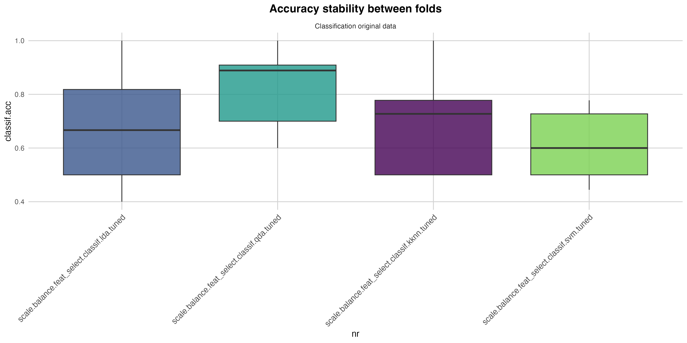
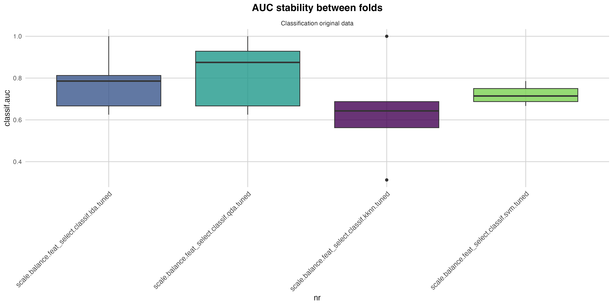
knitr::include_graphics("plot/roc_curves1.png")

kableExtra::kable(results1$confusion$QDA, caption = "Table 8: Confusion matrix QDA model") |>
  kableExtra::kable_styling(full_width = FALSE, font_size = 10) |>
  kableExtra::scroll_box(width = "100%", height = "400px")
```

All models were initially evaluated using a K-value threshold of 0.5. The results (Table 7) identify Quadratic Discriminant Analysis (QDA) as the best-performing classifier, with an accuracy of 81.9% and a specificity of 93.3%. The accuracy stability plot further shows that QDA not only achieves the highest median performance but also exhibits minimal variability across folds, indicating strong robustness.

Feature selection consistently highlighted wavelength V1459 as the most discriminative variable. This wavelength was selected by all models (LDA, QDA, and k-NN), underscoring its biophysical relevance. The separation between classes is particularly pronounced at this wavelength, with group means of 0.201 for fresh samples and −0.641 for deteriorated ones, allowing QDA to define a sharp and reliable decision boundary.

The confusion matrix (Table 8) confirms the conservative and reliable nature of the QDA classifier. Only one deteriorated sample was misclassified as fresh, minimizing food safety risk. Conversely, eight fresh samples were classified as deteriorated, reflecting a deliberate preference for false positives over false negatives. In contrast, SVM—using eight correlated variables in the V1387–V1480 range—achieved substantially lower accuracy (60.9%), indicating that the inclusion of multiple correlated features introduced noise rather than improving discrimination. In this dataset, a single well-chosen wavelength proved more effective than a broader multivariate input.

### Analysis of the Day 10 Outlier

```{r results.1, echo = FALSE, message = FALSE, warning = FALSE, fig.width = 12}
preds <- as.data.table(results1$resampling$QDA$prediction())

false_positive_idx <- preds[truth == "impending spoilage/spoiled" & response == "good/acceptable", row_ids]

data_wrong <- data_imputated[false_positive_idx, ]

errors <- data.frame(
  row_ID = false_positive_idx,
  day = data_wrong$day,
  `K value` = data_wrong$`K value`
  )

kableExtra::kable(errors, caption = "Table 9: Spoiled samples classified as Fresh (false positives)") |>
  kableExtra::kable_styling(full_width = FALSE, font_size = 10) |>
  kableExtra::scroll_box(width = "100%", height = "400px")
```

A single false negative was observed for a Day 10 sample with a K-value of 0.80 (Table 9). Although chemically this represents a clear case of spoilage, the misclassification is explainable from the physical perspective of NIR measurement.

First, the NIR sensor probes only the surface layers of the filet, whereas the K-value is derived from homogenized tissue. If internal degradation progressed more rapidly than surface deterioration—possibly due to uneven air exposure or the presence of a thin water or ice layer—the surface spectrum could still appear consistent with good quality.

Second, the model relies almost exclusively on V1459, associated with O–H and N–H bonds in water and proteins. Abnormal surface hydration or exudate could shift this wavelength into the “good” range by chance, despite advanced internal degradation.

Finally, instrumental factors such as imperfect probe contact or stray light may have altered the recorded spectrum. Since the model uses standardized values, even small intensity shifts can lead to misclassification at a single critical wavelength.

This sample represents the only false negative among 11 truly deteriorated samples, yielding very high specificity. Rather than undermining the model, this case highlights a fundamental limitation: NIR does not measure chemical spoilage directly, but its physical manifestations at the surface. When surface properties remain deceptively intact, internal chemical degradation may go undetected.

### Analysis of Model Performance at K-value Threshold 0.4

```{r analysis.1.1, echo = FALSE, message = FALSE, warning = FALSE, fig.width = 12}
data_imputated$class <- ifelse(data_imputated$`K value` < 0.2, "very fresh",
  ifelse(data_imputated$`K value` <= 0.4, "good/acceptable", "impending spoilage/spoiled"))

data_cluster_final <- data_cluster_final |> dplyr::select(!class)
data_cluster_final <- bind_cols(data_cluster_final, class = as.factor(data_imputated$class))

ggplot(data_imputated, aes(x = `K value`, fill = class)) +
  geom_histogram(position = "identity", alpha = 0.8, bins = 30, color = "white") +
  scale_fill_manual(values = c("good/acceptable" = "#003366", "impending spoilage/spoiled" = "#9B1B30"), name = "Class") +
  labs(
    title = "Distribution of K Values by Class",
    x = "K Value",
    y = "Count"
  ) +
  theme_minimal(base_size = 12) +
  theme(
    plot.title = element_text(hjust = 0.5, size = 16, face = "bold"),
    plot.subtitle = element_text(hjust = 0.5, size = 12, face = "bold"),
    axis.title = element_text(size = 12), axis.text = element_text(size = 10),
    panel.grid.major = element_line(color = "lightgray", linewidth = 0.5),
    panel.grid.minor = element_blank(), legend.position = "top", legend.title = element_text(face = "bold")
  )

task <- TaskClassif$new(
  id = "Classification original data",
  backend = data_cluster_final,
  target = "class",
  positive = "good/acceptable"
)

task$col_roles$stratum <- "class"

set.seed(123)
resampling_outer <- rsmp("cv", folds = 5)
resampling_instance <- resampling_outer$instantiate(task)

if (!file.exists("data/results/results1.1.rds")) {
feature_analysis(task, resampling_instance = resampling_instance, new_results = TRUE)
}

results1.1 <- readRDS("data/results/results1.1.rds")

kableExtra::kable(results1.1$performance, caption = "Table 11: Model performances (threshold 0.4)") |>
  kableExtra::kable_styling(full_width = FALSE, font_size = 10) |>
  kableExtra::scroll_box(width = "100%", height = "400px")

if (!file.exists("plot/accuracy_stability2.png")) {
  plot_benchmark_results(results1.1$benchmark_obj)
}

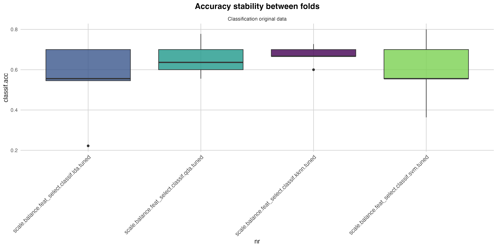
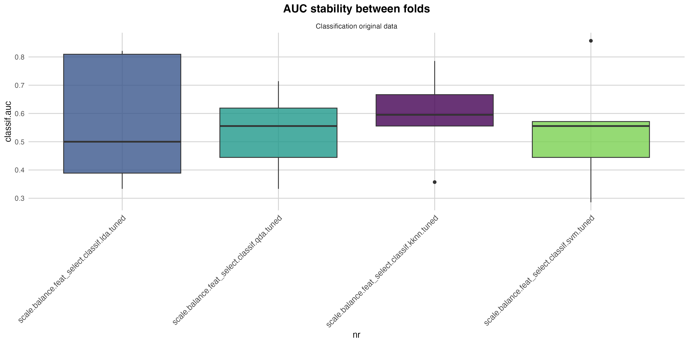
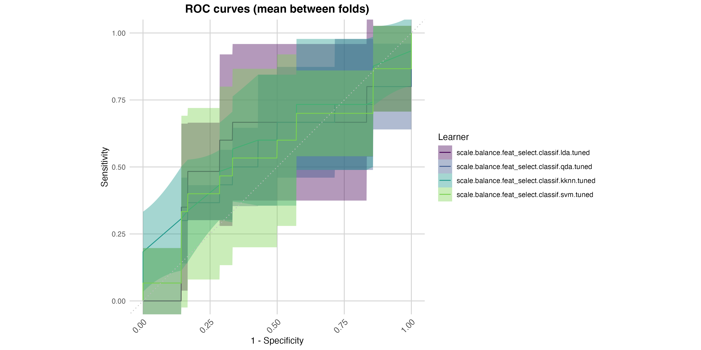
```

To assess the model’s ability to identify premium-quality fish, the K-value threshold was lowered from 0.5 to 0.4. This more stringent definition substantially altered classification performance.

Accuracy dropped markedly across all models: k-NN achieved the highest value (67.2%), followed by QDA (65.4%). Sensitivity for detecting high-quality samples was consistently low (0.40–0.60), indicating frequent misclassification of laboratory-defined “good” samples. Stability across folds deteriorated, as shown by wider and more irregular accuracy distributions.

Feature selection also became fragmented. Whereas all models converged on V1459 at the 0.5 threshold, no dominant wavelength emerged at 0.4. Selected features varied across learners, spanning regions around 1400 nm and 1900 nm, suggesting reliance on weak and distributed signals rather than a single strong marker. Although QDA retained relatively high specificity (75.7%), its AUC dropped to 0.53, indicating near-random discrimination and a tendency to classify most samples as spoiled to preserve specificity.

These results show that lowering the threshold exposes the limits of single-variable models when attempting to distinguish very fresh fish, where biochemical differences are subtle and not strongly expressed in individual wavelengths.

### Implications of Lowering the Threshold to 0.4

```{r results.1.1, echo = FALSE, message = FALSE, warning = FALSE, fig.width = 12}
preds <- as.data.table(results1.1$resampling$QDA$prediction())

false_positive_idx <- preds[truth == "impending spoilage/spoiled" & response == "good/acceptable", row_ids]

data_wrong <- data_imputated[false_positive_idx, ]

errors <- data.frame(
  row_ID = false_positive_idx,
  day = data_wrong$day,
  `K value` = data_wrong$`K value`
  )

kableExtra::kable(errors, caption = "Table 12: Spoiled samples classified as Fresh (false positives)") |>
  kableExtra::kable_styling(full_width = FALSE, font_size = 10) |>
  kableExtra::scroll_box(width = "100%", height = "400px")
```

A K-value threshold of 0.4 effectively reframes the instrument as a tool for certifying premium-quality fish. In this context, misclassifications concentrate in the 0.40–0.49 range, corresponding mainly to samples from Days 4 to 8. These samples represent a biochemical transition phase: although their physical appearance remains largely intact, they have already surpassed the threshold of maximal freshness. This overlap inherently increases classification difficulty and emphasizes the limits of surface-based spectral measurements.

### Principal Component Analysis

```{r analysis.2, echo = FALSE, message = FALSE, warning = FALSE, fig.width = 12}
pca_res <- prcomp(data_cluster_final[, -141], center = TRUE, scale. = TRUE)

var_exp <- head(summary(pca_res)$importance[3, ], 12)

dt_var_exp <- as.data.frame(t(var_exp))

kableExtra::kable(dt_var_exp, "html", caption = "Table 13: Cumulative variance explained by PCA components") |>
  kableExtra::kable_styling(full_width = FALSE, font_size = 10)

pca_representation_facet(pca_res, as.factor(data_cluster_final$class), 6)

if (!file.exists("data/results/results2.rds")) {
  feature_analysis(task, resampling_instance = resampling_instance, filter = FALSE, pca = TRUE)
}

results2 <- readRDS("data/results/results2.rds")

kableExtra::kable(results2$performance, caption = "Table 14: Model performances (PCA)") |>
  kableExtra::kable_styling(full_width = FALSE, font_size = 10) |>
  kableExtra::scroll_box(width = "100%", height = "400px")

if (!file.exists("plot/accuracy_stability3.png")) {
  plot_benchmark_results(results2$benchmark_obj)
}

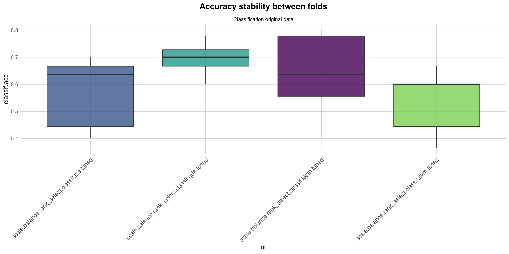
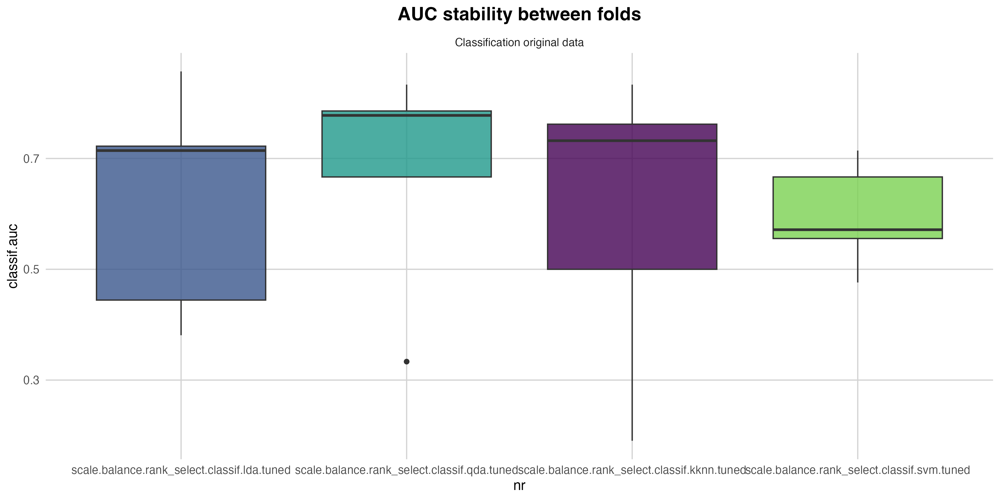
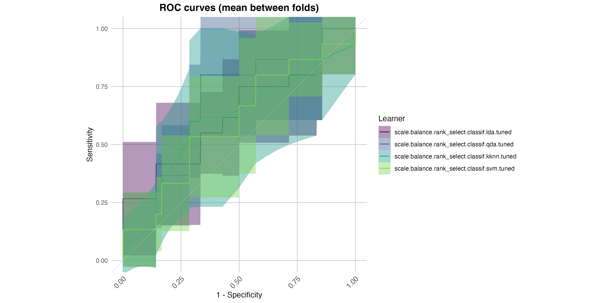
```

Using principal components at the 0.4 threshold partially recovered the predictive power lost with single-wavelength models. The first 12 PCs accounted for approximately 98% of total variance, but optimal performance was achieved using only a subset of them.

QDA again emerged as the best classifier, reaching an accuracy of 69.4% and an AUC of 0.679. Notably, sensitivity increased to 0.80 when using the first three PCs, indicating that the information required to identify loss of premium quality is distributed across multiple spectral dimensions. Models incorporating additional PCs generally performed worse, suggesting that higher-order components mainly introduce noise.

Stability analysis confirmed that, while PCA improves average performance, variability across folds remains higher than at the 0.5 threshold. ROC curves further showed that QDA maintains the best balance between sensitivity and specificity, whereas SVM remains close to random performance.

### Interpretation of PCA Loadings for Premium-Quality Classification

```{r results.3, echo = FALSE, message = FALSE, warning = FALSE, fig.width = 12}
loadings_df <- as.data.frame(pca_res$rotation[, 1:12])
loadings_df$wavelength <- as.numeric(gsub("V", "", rownames(loadings_df)))

loadings_long <- loadings_df |>
  pivot_longer(
    cols = starts_with("PC"), 
    names_to = "PC", 
    values_to = "Weight"
  ) |> mutate(PC = factor(PC, levels = paste0("PC", 1:12)))

p <- ggplot(loadings_long, aes(x = wavelength, y = Weight, color = PC)) +
  geom_line(show.legend = FALSE) +
  facet_wrap(~PC, scales = "free_y", ncol = 3) +
  labs(
    title = "First 12 PCA loadings",
    x = "Wavelength (nm)",
    y = "Loading Weight"
  ) +
  theme_minimal(base_size = 12) +
  theme(
    plot.title = element_text(hjust = 0.5, size = 16, face = "bold"),
    axis.title = element_text(size = 12), axis.text = element_text(size = 10),
    panel.grid.major = element_line(color = "lightgray", linewidth = 0.5),
    panel.grid.minor = element_blank(), legend.position = "top", legend.title = element_text(face = "bold")
  )

ggsave(filename = "plot/PCA_loadings.png", plot = p, width = 12, height = 6, dpi = 300)
knitr::include_graphics("plot/PCA_loadings.png")
```

Inspection of PCA loadings clarifies the nature of the discriminative information. The first three PCs capture dominant physical effects related to water content and muscle structure, with strong features around 1450 nm and 1900–2000 nm. In contrast, intermediate components—particularly PC6 and PC7—exhibit narrower and more specific peaks linked to lipid (C–H) and protein (N–H) combination bands. These components appear critical for distinguishing premium-quality fish, as they reflect early biochemical changes rather than gross physical differences. Later components mainly represent instrumental noise, with only weak residual signals related to advanced spoilage.

### Optimized QDA Performance Using Principal Components

```{r analysis.3, echo = FALSE, message = FALSE, warning = FALSE, fig.width = 12}
pc_pool <- paste0("PC", 1:8)

min_pc <- 2
max_pc <- 6

combinations_list <- map(min_pc:max_pc, function(k) {
  combs <- combn(pc_pool, k, simplify = FALSE)
  combs
}) |> flatten()

if (!file.exists("data/results/results_list.rds")) {
  results_list <- lapply(combinations_list, function(x) {
  model_qda_deep_dive(task, resampling_instance =  resampling.instance, pca_fix = TRUE, pca_selected = x)
})
  saveRDS(results_list, file = "data/results/results_list.rds")
}

results_list <- readRDS("data/results/results_list.rds")

summary_df <- imap_dfr(results_list, extract_metrics)

top_10_results <- summary_df |> arrange(desc(auc), desc(spec)) |> head(10)
rownames(top_10_results) <- top_10_results$rank
top_10_results <- top_10_results |> dplyr::select(!rank)

kableExtra::kable(top_10_results, caption = "Table 15: Best model performances for different PCA combinations") |>
  kableExtra::kable_styling(full_width = FALSE, font_size = 10) |>
  kableExtra::scroll_box(width = "100%", height = "400px")

if (!file.exists("data/results/results_final.rds")) {
  result_final<- model_qda_deep_dive(task, resampling_instance = resampling.instance, pca_rank = 12, pca_fix = TRUE, pca_selected = c("PC1", "PC2", "PC3", "PC4", "PC6", "PC7"))
  saveRDS(result_final, file = "data/results/results_final.rds")
}

result_final <- readRDS("data/results/results_final.rds")

kableExtra::kable(t(result_final$performance), "html", caption = "Table 16: Optimized QDA model") |>
  kableExtra::kable_styling(full_width = FALSE, font_size = 10)

kableExtra::kable(result_final$confusion_matrix, caption = "Table 17: Optimized QDA confusion matrix") |>
  kableExtra::kable_styling(full_width = FALSE, font_size = 10) |>
  kableExtra::scroll_box(width = "100%", height = "400px")

bmr <- as_benchmark_result(result_final$resampling_results)

if (!file.exists("plot/accuracy_stability4.png")) {
  plot_benchmark_results(results1$benchmark_obj)
}

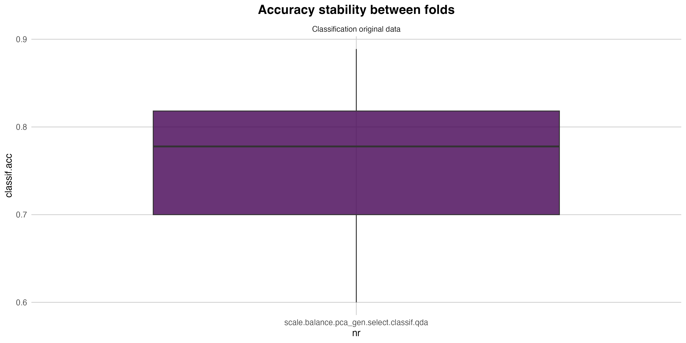
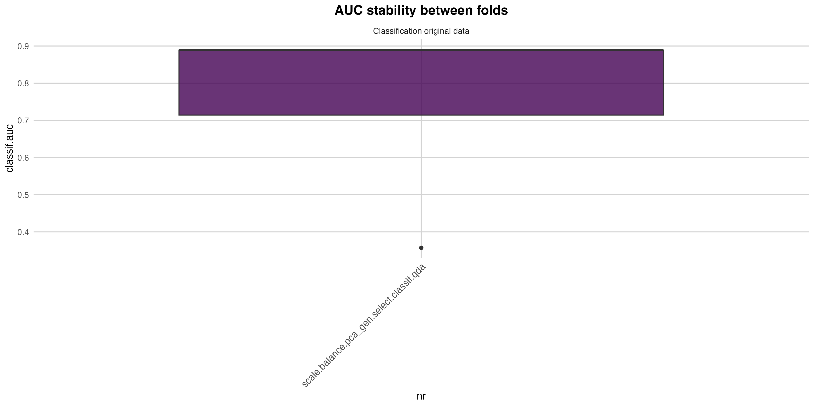
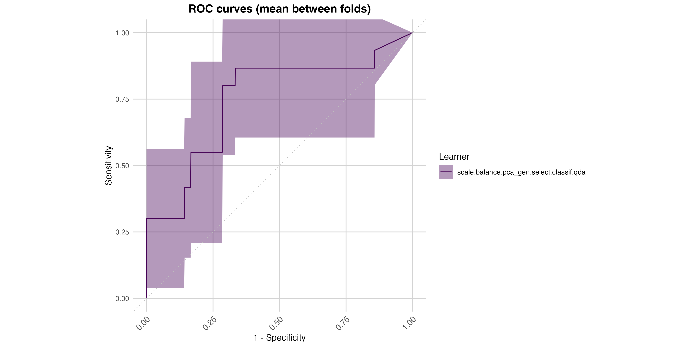
```

An optimized QDA model using PCs 1, 2, 3, 4, 6, and 7 achieved the best overall performance at the 0.4 threshold. Accuracy increased to 75.7%, with an AUC of 0.748. The confusion matrix reveals a commercially relevant balance: specificity of 0.819 ensures that most samples losing premium status are correctly downgraded, while sensitivity of 0.617 reflects a conservative bias against falsely promoting borderline products.

Unlike the 0.5 threshold scenario, this model does not simply detect spoilage but identifies the loss of premium quality. The prominence of PC6 and PC7 confirms that this transition is driven by subtle biochemical changes, particularly in proteins and lipids, which require a multivariate and non-linear model to be captured effectively.

### Error Analysis and Threshold Effects

```{r results.4, echo = FALSE, message = FALSE, warning = FALSE, fig.width = 12}
preds <- as.data.table(result_final$resampling_result$prediction())

false_positive_idx <- preds[truth == "impending spoilage/spoiled" & response == "good/acceptable", row_ids]

data_wrong <- data_imputated[false_positive_idx, ]

errors <- data.frame(
  row_ID = false_positive_idx,
  day = data_wrong$day,
  `K value` = data_wrong$`K value`
  )

kableExtra::kable(errors, caption = "Table 18: Spoiled samples classified as Fresh (false positives)") |>
  kableExtra::kable_styling(full_width = FALSE, font_size = 10) |>
  kableExtra::scroll_box(width = "100%", height = "400px")
```

Residual misclassifications remain concentrated in the 0.4–0.5 K-value interval, reinforcing the conclusion that lowering the threshold increases class overlap and reduces separability. While PCA and optimized QDA substantially improve performance, the results highlight an intrinsic limitation of NIR spectroscopy: distinguishing between “excellent” and merely “good” fish is fundamentally more challenging than identifying clear deterioration.

## **Overall study results**

This study demonstrates that NIR spectroscopy can reliably discriminate between marketable and non-marketable fish when freshness is defined using a conservative K-value threshold (K = 0.5), but that its discriminative power decreases substantially when the task is shifted toward identifying premium freshness (K = 0.4).

At the 0.5 threshold, classification performance is strong and stable. A single wavelength (V1459), associated with water–protein interactions, is sufficient to capture the dominant physical changes accompanying fish deterioration. Quadratic Discriminant Analysis (QDA) achieves high accuracy (~82%) and very high specificity (>93%), with minimal variability across cross-validation folds. Misclassifications are rare and predominantly conservative, indicating that NIR is well suited for screening spoiled or near-spoiled products with minimal food-safety risk.

Lowering the threshold to 0.4 fundamentally changes the problem. The spectral differences between “excellent” and “acceptable” fish become subtle, distributed, and chemically driven rather than dominated by bulk physical changes. As a result, single-wavelength models collapse in performance, feature selection becomes unstable, and all classifiers show reduced accuracy, sensitivity, and robustness. This confirms that premium freshness cannot be captured by a single dominant spectral marker.

Multivariate approaches partially recover performance at the stricter threshold. Principal Component Analysis reveals that the relevant information is spread across multiple spectral regions, particularly those associated with early protein and lipid modifications. When QDA is applied to an optimized subset of principal components, classification accuracy increases to ~76% with a balanced trade-off between sensitivity and specificity. Although performance remains lower and less stable than at the 0.5 threshold, these results demonstrate that premium-quality assessment is feasible only through multivariate, non-linear modeling.

Overall, the findings highlight a clear operational distinction:

- For marketability control (K ≥ 0.5), NIR provides a robust, simple, and highly reliable solution based on a single wavelength.

- For premium-quality certification (K ≥ 0.4), NIR requires multivariate analysis and remains inherently more uncertain due to overlapping biochemical states and surface-limited sensing.

In practical terms, NIR spectroscopy is best positioned as a screening tool for spoilage and safety, while its use for certifying premium freshness demands more complex models and should be interpreted with caution.
