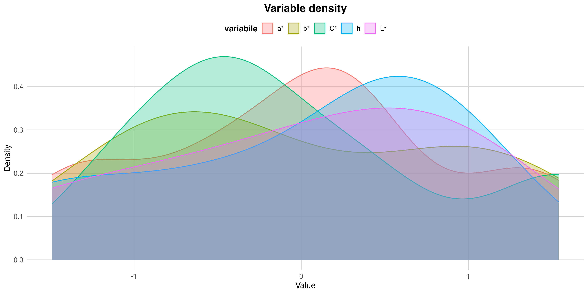
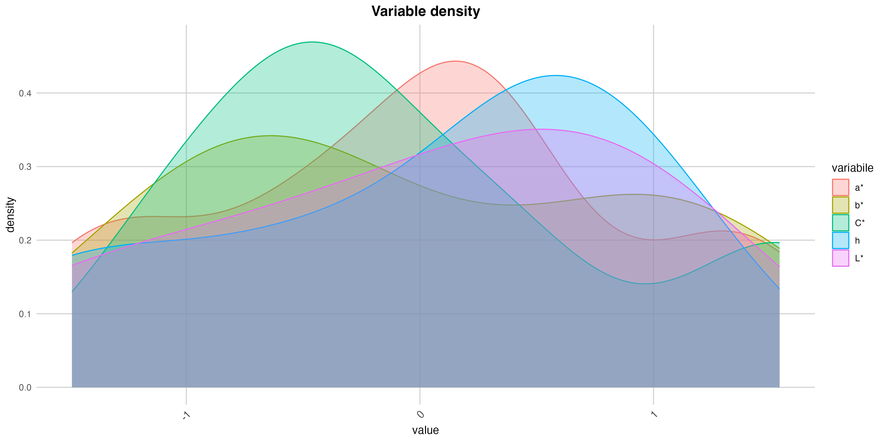
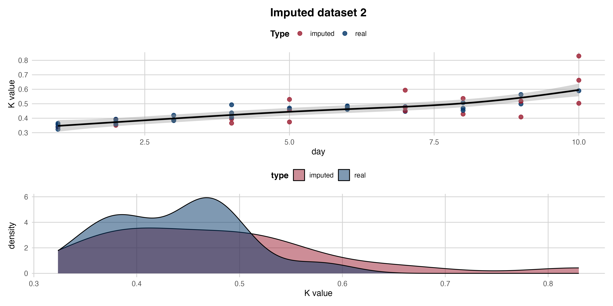
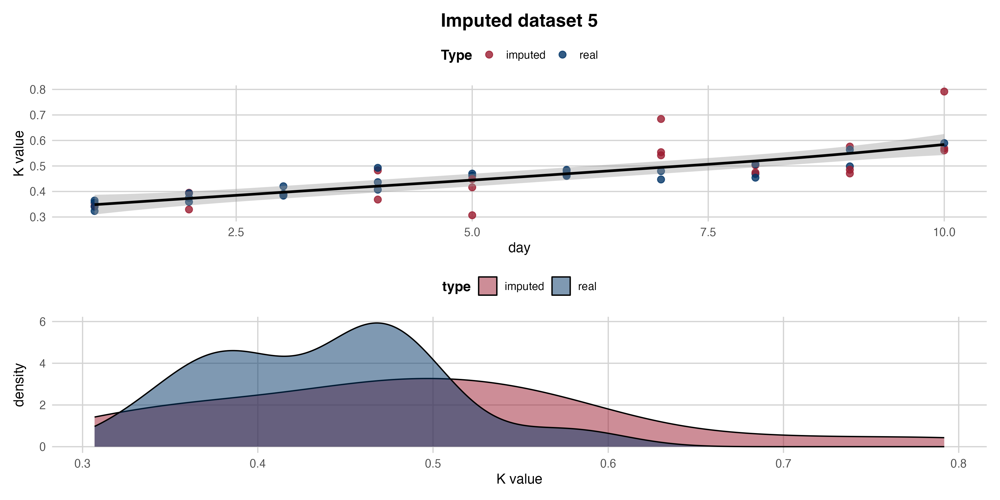
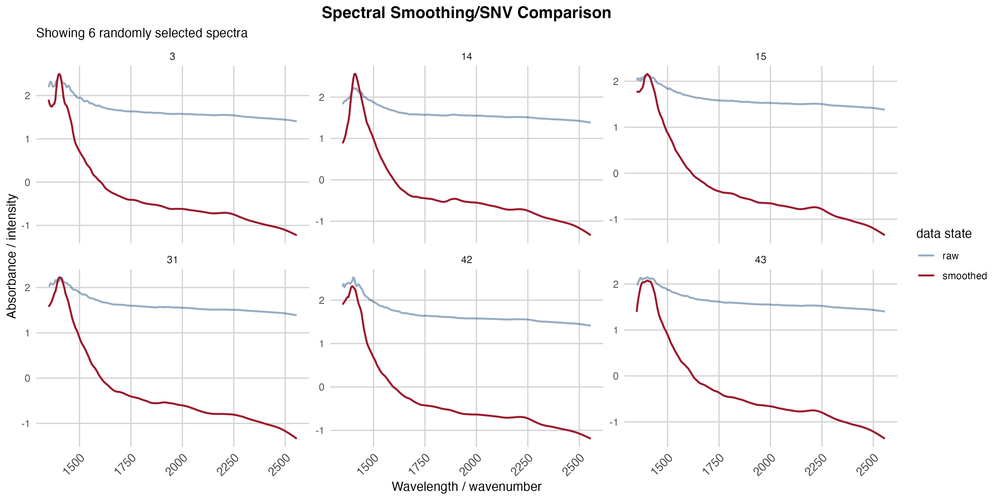

# **Introduction**

### *Introduction and study objectives*

### *Main objectives*

# **Data analysis**

### *Data preparation and pre-processing*

```{r exploration.1, echo = FALSE, message = FALSE, warning = FALSE, fig.width = 12}
source("settings.R")
source("source_all.R")

if (!file.exists("data/intermediate/data analysis.rds")) {
  build_data_main()
}

data.analysis <- readRDS("data/intermediate/data analysis.rds")



```

```{r exploration.2, echo = FALSE, message = FALSE, warning = FALSE, fig.width = 12}
pattern <- "^[[:digit:]]*$"
data.for.imputation <- data.analysis |> dplyr::select(!c(grep(pattern, colnames(data.analysis)), sample))

flextable(as.data.frame(cor(data.for.imputation, use = "complete.obs")))

m <- 10
imp <- mice(data.for.imputation[, -7], m = m, maxit = 50, seed = 123, method = "pmm", printFlag = FALSE)

imputed.Kvalues <- lapply(seq_len(m), function(i) {
  df <- complete(imp, i)
  df$`K value` <- calculate.kvalue(df)
})

imputed.pos <- which(is.na(data.for.imputation$`K value`))
real.vals <- data.for.imputation$`K value`[-imputed.pos]

ks.distances <- vapply(imputed.Kvalues, function(x) {
  imputed.vals <- x[imputed.pos]
  
  ks.test(real.vals, imputed.vals)$statistic
}, numeric(1))

best.idx <- which.min(unname(ks.distances))
cat(paste0("Statistical Distribution (KS-Test): Dataset ", best.idx, " is the most faithful to the original data shape."))

trend.errors <- vapply(imputed.Kvalues, function(x) {
  df.temp <- data.frame(k = x, day = data.for.imputation$day)
  mod <- lm(k ~ day, data = df.temp[-imputed.pos, ])

  preds <- predict(mod, newdata = df.temp[imputed.pos, ])
  mean((x[imputed.pos] - preds)^2)
}, numeric(1))

best.idx <- which.min(trend.errors)
cat(paste0("Biological Trend (MSE-Linear): Dataset ", best.idx, " is the most consistent with the degradation over time."))

complete.data <- complete(imp, "long")

flextable(as.data.frame(cor(complete.data[, -c(14, 15)], use = "complete.obs")))
flextable(as.data.frame(cor(data.for.imputation[, -7], use = "complete.obs")))
```

```{r exploration.3, echo = FALSE, message = FALSE, warning = FALSE, fig.width = 12}
imputed.df <- lapply(seq_len(m), function(i) {
  df <- complete(imp, i)
  df$`K value` <- calculate.kvalue(df)
  df
})

graphics <- lapply(seq_along(imputed.df), function(i) {
  graphical.comparation(imputed.df[[i]], imputed_pos = imputed.pos, x = "day", y = "K value", x_ignore = TRUE, dataset_id = i)
})




data.imputated <- imputed.df[[5]]
```

```{r exploration.3, echo = FALSE, message = FALSE, warning = FALSE, fig.width = 12}
data.imputated$class <- ifelse(data.imputated$`K value` < 0.2, "very fresh",
  ifelse(data.imputated$`K value` <= 0.5, "good/acceptable", "impending spoilage/spoiled"))

data.imputated$class <- as.factor(data.imputated$class)
table(data.imputated$class)

ggplot(data.imputated, aes(x = `K value`, fill = class)) +
  geom_histogram(position = "identity", alpha = 0.8, bins = 30) +
  scale_fill_manual(values = c("good/acceptable" = "#003366", "impending spoilage/spoiled" = "#9B1B30")) +
  labs(
    title = "Histogram of K value distribution by class",
    x = "K value",
    y = "Frequency"
  ) +
  theme_minimal() +
  theme(
    plot.title = element_text(hjust = 0.5, size = 14, face = "bold"),
    panel.grid.major = element_line(color = "lightgray", linewidth = 0.5),
    panel.grid.minor = element_blank())
```

```{r exploration.4, echo = FALSE, message = FALSE, warning = FALSE, fig.width = 12}
data.cluster <- data.analysis |> dplyr::select(grep("^[[:digit:]]*$", colnames(data.analysis), value = TRUE))
colnames(data.cluster) <- paste0("V", colnames(data.cluster))

data.cluster.smooth <- smoothing(data.cluster)
data.cluster.snv <- as_tibble(t(apply(data.cluster.smooth, MARGIN = 1, FUN = normalization)))

plot_spectral_comparison(data.cluster, data.cluster.snv, n_samples = 6)


data.cluster.final <- bind_cols(data.cluster.snv, class = data.imputated$class)
```

- large dataset, 5 measure position equivalent to each other (as seen in the hraphic, densities have are not symmetric), aggregation through median sample value. 
- variables used for imputation not normal (kolmogorov-smirnov test), so pmm best imputation method
- missing values (MAR) - imputation of missing trhough predictive mean matching (10 dataset imputaed, best dataset choosen - see graphic, imputed values for k-value overlapping the best)
- spectral measures aggregated through median, smoothed by taking 
- classification of samples thanks to kvalue - very fresh, fresh, deteriorated, very deteriorated

### *Correlation vs. feature selection*

-discussion about why feature seleciton is better than correlation

```{r features, echo = FALSE, message = FALSE, warning = FALSE, fig.width = 12}
task <- TaskClassif$new(
  id = "Classification original data",
  backend = data.cluster.final,
  target = "class",
  positive = "good/acceptable"
)

task$col_roles$stratum <- "class"

methods <- c("anova", "auc", "mrmr")
tab <- as.data.frame(lapply(methods, function(i) feature_selection(task, i)))
colnames(tab) <- methods
head(tab, 10)
```

-auc and anova confirms some interesting features, we expect algorithm to choose similar features

### *QDA, LDA, k-NN and SVM on raw data (scaled and balanced) components*

```{r analysis.1, echo = FALSE, message = FALSE, warning = FALSE, fig.width = 12}
set.seed(123)
resampling.outer <- rsmp("cv", folds = 5)
resampling.instance <- resampling.outer$instantiate(task)

if (!file.exists("data/results/results1.rds")) {
  feature_analysis(task, resampling_instance = resampling.instance)
}

results1 <- readRDS("data/results/results1.rds")
results1$performance

autoplot(results1$benchmark_obj, measure = msr("classif.auc")) + 
  labs(title = "AUC satbility between folds") +
  theme_minimal() +
  theme(
    axis.text.x = element_text(size = 10, angle = 45, hjust = 1),
    plot.title = element_text(hjust = 0.5, size = 14, face = "bold"),
    panel.grid.major = element_line(color = "lightgray", linewidth = 0.5),
    panel.grid.minor = element_blank())

autoplot(results1$benchmark_obj, measure = msr("classif.acc")) + 
  labs(title = "Accuracy stability between folds") +
  theme_minimal() +
  theme(
    axis.text.x = element_text(size = 10, angle = 45, hjust = 1),
    plot.title = element_text(hjust = 0.5, size = 14, face = "bold"),
    panel.grid.major = element_line(color = "lightgray", linewidth = 0.5),
    panel.grid.minor = element_blank())

autoplot(results1$benchmark_obj, type = "roc") + 
  labs(title = "ROC curves (mean between folds)") +
  theme_minimal() +
  theme(
    axis.text.x = element_text(size = 10, angle = 45, hjust = 1),
    plot.title = element_text(hjust = 0.5, size = 14, face = "bold"),
    panel.grid.major = element_line(color = "lightgray", linewidth = 0.5),
    panel.grid.minor = element_blank())

results1$learners$LDA$learner$graph_model$pipeops$feat_select$state$outtasklayout
results1$learners$QDA$learner$graph_model$pipeops$feat_select$state$outtasklayout
results1$learners$kNN$learner$graph_model$pipeops$feat_select$state$outtasklayout
results1$learners$SVM$learner$graph_model$pipeops$feat_select$state$outtasklayout

results1$confusion$QDA

results1$learners$QDA$learner$model$classif.qda$model
```

### *Model deficencies discussion*

```{r results.1, echo = FALSE, message = FALSE, warning = FALSE, fig.width = 12}
preds <- as.data.table(results1$resampling$QDA$prediction())
preds[, .(row_ids, truth, response,`prob.good/acceptable` = round(`prob.good/acceptable`, digits = 4), `prob.impending spoilage/spoiled` = round(`prob.impending spoilage/spoiled`, digits = 4))]

false.positive.idx <- preds[truth == "impending spoilage/spoiled" & response == "good/acceptable", row_ids]

data.wrong <- data.imputated[false.positive.idx, ]

errors <- data.frame(
  row_ID = false.positive.idx,
  day = data.wrong$day
  )

cat("Spoiled samples classified as Fresh (false positives)")
print(errors)

data.imputated[errors$row_ID,]$`K value`
```


```{r analysis.1.1, echo = FALSE, message = FALSE, warning = FALSE, fig.width = 12}
data.imputated$class <- ifelse(data.imputated$`K value` < 0.2, "very fresh",
  ifelse(data.imputated$`K value` <= 0.4, "good/acceptable", "impending spoilage/spoiled"))

data.cluster.final <- data.cluster.final |> dplyr::select(!class)
data.cluster.final <- bind_cols(data.cluster.final, class = as.factor(data.imputated$class))
table(data.cluster.final$class)

task <- TaskClassif$new(
  id = "Classification original data",
  backend = data.cluster.final,
  target = "class",
  positive = "good/acceptable"
)

task$col_roles$stratum <- "class"

methods <- c("anova", "auc", "mrmr")
tab <- as.data.frame(lapply(methods, function(i) feature_selection(task, i)))
colnames(tab) <- methods
head(tab, 10)

set.seed(123)
resampling.outer <- rsmp("cv", folds = 5)
resampling.instance <- resampling.outer$instantiate(task)

if (!file.exists("data/results/results1.1.rds")) {
feature_analysis(task, resampling_instance = resampling.instance, new.results = TRUE)
}

results1.1 <- readRDS("data/results/results1.1.rds")
results1.1$performance

autoplot(results1.1$benchmark_obj, measure = msr("classif.auc")) + 
  labs(title = "AUC satbility between folds") +
  theme_minimal() +
  theme(
    axis.text.x = element_text(size = 10, angle = 45, hjust = 1),
    plot.title = element_text(hjust = 0.5, size = 14, face = "bold"),
    panel.grid.major = element_line(color = "lightgray", linewidth = 0.5),
    panel.grid.minor = element_blank())

autoplot(results1.1$benchmark_obj, measure = msr("classif.acc")) + 
  labs(title = "Accuracy stability between folds") +
  theme_minimal() +
  theme(
    axis.text.x = element_text(size = 10, angle = 45, hjust = 1),
    plot.title = element_text(hjust = 0.5, size = 14, face = "bold"),
    panel.grid.major = element_line(color = "lightgray", linewidth = 0.5),
    panel.grid.minor = element_blank())

autoplot(results1.1$benchmark_obj, type = "roc") + 
  labs(title = "ROC curves (mean between folds)") +
  theme_minimal() +
  theme(
    axis.text.x = element_text(size = 10, angle = 45, hjust = 1),
    plot.title = element_text(hjust = 0.5, size = 14, face = "bold"),
    panel.grid.major = element_line(color = "lightgray", linewidth = 0.5),
    panel.grid.minor = element_blank())

results1.1$learners$LDA$learner$graph_model$pipeops$feat_select$state$outtasklayout
results1.1$learners$QDA$learner$graph_model$pipeops$feat_select$state$outtasklayout
results1.1$learners$kNN$learner$graph_model$pipeops$feat_select$state$outtasklayout
results1.1$learners$SVM$learner$graph_model$pipeops$feat_select$state$outtasklayout
```

### *Model deficencies discussion*

```{r results.1.1, echo = FALSE, message = FALSE, warning = FALSE, fig.width = 12}
preds <- as.data.table(results1.1$resampling$QDA$prediction())
preds[, .(row_ids, truth, response,`prob.good/acceptable` = round(`prob.good/acceptable`, digits = 4), `prob.impending spoilage/spoiled` = round(`prob.impending spoilage/spoiled`, digits = 4))]

false.positive.idx <- preds[truth == "impending spoilage/spoiled" & response == "good/acceptable", row_ids]

data.wrong <- data.imputated[false.positive.idx, ]

errors <- data.frame(
  row_ID = false.positive.idx,
  day = data.wrong$day
  )

cat("Spoiled samples classified as Fresh (false positives)")
print(errors)

data.imputated[errors$row_ID,]$`K value`
```

### *QDA, LDA, k-NN and SVM on PCA components*

```{r analysis.2, echo = FALSE, message = FALSE, warning = FALSE, fig.width = 12}

pca.res <- prcomp(data.cluster.final[, -141], center = TRUE, scale. = TRUE)
head(summary(pca.res)$importance[3, ], n = 12)

pca_representation_facet(pca.res, as.factor(data.cluster.final$class), 6)

if (!file.exists("data/results/results2.rds")) {
  feature_analysis(task, resampling_instance = resampling.instance, filter = FALSE, pca = TRUE)
}

results2 <- readRDS("data/results/results2.rds")
results2$performance

autoplot(results2$benchmark_obj, measure = msr("classif.auc")) + 
  labs(title = "AUC stability between folds") +
  theme_minimal() +
  theme(
    axis.text.x = element_text(size = 10, angle = 45, hjust = 1),
    plot.title = element_text(hjust = 0.5, size = 14, face = "bold"),
    panel.grid.major = element_line(color = "lightgray", linewidth = 0.5),
    panel.grid.minor = element_blank())

autoplot(results2$benchmark_obj, measure = msr("classif.acc")) + 
  labs(title = "Accuracy stability between folds") +
  theme_minimal() +
  theme(
    axis.text.x = element_text(size = 10, angle = 45, hjust = 1),
    plot.title = element_text(hjust = 0.5, size = 14, face = "bold"),
    panel.grid.major = element_line(color = "lightgray", linewidth = 0.5),
    panel.grid.minor = element_blank())

autoplot(results2$benchmark_obj, type = "roc") + 
  labs(title = "ROC curves (mean between folds)") +
  theme_minimal() +
  theme(
    axis.text.x = element_text(size = 10, angle = 45, hjust = 1),
    plot.title = element_text(hjust = 0.5, size = 14, face = "bold"),
    panel.grid.major = element_line(color = "lightgray", linewidth = 0.5),
    panel.grid.minor = element_blank())

results2$learners$LDA$learner$graph_model$pipeops$rank_select$state$outtasklayout
results2$learners$QDA$learner$graph_model$pipeops$rank_select$state$outtasklayout
results2$learners$kNN$learner$graph_model$pipeops$rank_select$state$outtasklayout
results2$learners$SVM$learner$graph_model$pipeops$rank_select$state$outtasklayout
```

### *Brute force selection for pca components in qda model*

```{r analysis.4, echo = FALSE, message = FALSE, warning = FALSE, fig.width = 12}

# Definiamo il pool di componenti basandoci sull'evidenza dei tuoi modelli precendenti
pc_pool <- paste0("PC", 1:8)

# Generiamo tutte le combinazioni da 2 a 6 elementi. Questo produrrà esattamente 238 combinazioni
min_pc <- 2
max_pc <- 6

combinations_list <- map(min_pc:max_pc, function(k) {
  combs <- combn(pc_pool, k, simplify = FALSE)
  combs
}) |> flatten()

print(paste("Totale combinazioni da testare:", length(combinations_list)))

if (!file.exists("data/results/results_list.rds")) {
  results_list <- lapply(combinations_list, function(x) {
  model_qda_deep_dive(task, resampling_instance =  resampling.instance, pca_fix = TRUE, pca_selected = x)
})
  saveRDS(results_list, file = "data/results/results_list.rds")
}

results_list <- readRDS("data/results/results_list.rds")

summary_df <- imap_dfr(results_list, extract_metrics)

top_10_results <- summary_df |> arrange(desc(auc), desc(spec)) |> head(10)
rownames(top_10_results) <- top_10_results$rank
top_10_results |> dplyr::select(!rank)
print(top_10_results)

if (!file.exists("data/results/results_final.rds")) {
  result_final<- model_qda_deep_dive(task, resampling_instance = resampling.instance, pca_rank = 12, pca_fix = TRUE, pca_selected = c("PC2", "PC3", "PC5", "PC8"))
  saveRDS(result_final, file = "data/results/results_final.rds")
}

results_final <- readRDS("data/results/results_final.rds")
results_final$performance
results_final$confusion_matrix

bmr <- as_benchmark_result(results_final$resampling_results)

autoplot(bmr, measure = msr("classif.auc")) + 
  labs(title = "AUC stability between folds") +
  theme_minimal() +
  theme(
    axis.text.x = element_text(size = 10, angle = 45, hjust = 1),
    plot.title = element_text(hjust = 0.5, size = 14, face = "bold"),
    panel.grid.major = element_line(color = "lightgray", linewidth = 0.5),
    panel.grid.minor = element_blank())

autoplot(bmr, measure = msr("classif.acc")) + 
  labs(title = "Accuracy stability between folds") +
  theme_minimal() +
  theme(
    axis.text.x = element_text(size = 10, angle = 45, hjust = 1),
    plot.title = element_text(hjust = 0.5, size = 14, face = "bold"),
    panel.grid.major = element_line(color = "lightgray", linewidth = 0.5),
    panel.grid.minor = element_blank())

autoplot(bmr, type = "roc") + 
  labs(title = "ROC curves (mean between folds)") +
  theme_minimal() +
  theme(
    axis.text.x = element_text(size = 10, angle = 45, hjust = 1),
    plot.title = element_text(hjust = 0.5, size = 14, face = "bold"),
    panel.grid.major = element_line(color = "lightgray", linewidth = 0.5),
    panel.grid.minor = element_blank())
```

### *Model deficencies discussion*

```{r results, echo = FALSE, message = FALSE, warning = FALSE, fig.width = 12}
# Estraiamo le predizioni
preds <- as.data.table(results_final$resampling_results$prediction())
preds[, .(row_ids, truth, response,`prob.good/acceptable` = round(`prob.good/acceptable`, digits = 4), `prob.impending spoilage/spoiled` = round(`prob.impending spoilage/spoiled`, digits = 4))]

# Identifichiamo i Falsi Positivi (Verità = deteriorated, Risposta = fresh)
falsi_positivi_ids <- preds[truth == "impending spoilage/spoiled" & response == "good/acceptable", row_ids]

# Estraiamo i dati dal dataset originale
colpevoli_data <- data.imputated[falsi_positivi_ids, ]

# Creiamo il riepilogo (usa i nomi esatti delle tue colonne)
riepilogo_errori <- data.frame(
  Row_ID = falsi_positivi_ids,
  Giorno = colpevoli_data$day
  )

print("--- Campioni Deteriorati classificati come Fresh (Falsi Positivi) ---")
print(riepilogo_errori)
```


## **Results**

